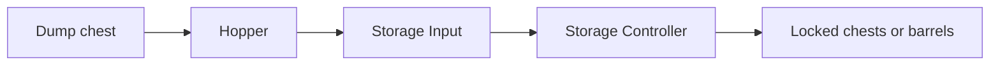

# Build automatic storage with the mods already in Mythic Prehistory

🔧 **Ready to build**

**Recommended:** use Sophisticated Storage for automatic sorting, then add Tom's Simple Storage if you want one searchable screen.

| Want | Use |
|---|---|
| Dump items into one chest and sort them | Sophisticated Storage |
| Search every chest from one screen | Tom's Simple Storage |

## Automatic sorting



Build this starter footprint first:

```text
TOP VIEW

[B][B][B]
[B][C][I] ← [H]

D sits directly above H
```

| Mark | Block |
|---|---|
| `B` | Sophisticated Storage chest or barrel |
| `C` | Storage Controller |
| `I` | Storage Input |
| `H` | Vanilla hopper, with its nozzle pointing into `I` |
| `D` | Dump chest |

1. Place `C`, then place `I` touching its right side.
2. Place the `B` blocks touching `C` or another `B` by a full face. Diagonal contact does not count.
3. Crouch-place `H` against the outside face of `I` so the hopper nozzle points into `I`.
4. Place `D` directly on top of `H`.
5. Put one sample item in each destination barrel or chest. Leave one general chest for unmatched items.
6. Drop more of a sample item into `D`; it should travel through `H` and `I` into the matching storage.

Anything dropped into the dump chest will enter the storage group. Existing stacks and locked slots give the system destinations; keep one general chest for unmatched items.

## One searchable terminal

Add this only after the automatic sorter above passes its one-item test.

```text
[Sophisticated storage] [Storage Controller] [Tom's Storage Terminal]
```

1. Leave one face of the **Storage Controller** exposed.
2. Crouch-place Tom's **Storage Terminal** directly against that face. A **Crafting Terminal** also works and adds a crafting grid.
3. Right-click the terminal. It should show every item connected to the Controller.
4. Search for a known item and withdraw one to prove both reading and extraction work.

The Controller already presents the whole Sophisticated network as one inventory, so this hybrid does not need an Inventory Connector or cables. Keep those pieces for distant vanilla chests or a separate Tom's network.

Use JEI to see the exact recipes: search `@sophisticatedstorage` or `@toms_storage`.

## When a chest preview faces the wrong way

- Press `Home` to toggle Block Preview off. The mod has no rotate control.
- A chest placed from your hotbar faces you. Stand where you want its latch/front, then place it.
- A chest carried with Carry On (`C`) keeps its old facing. Carry On also has no rotate control.
- Do not use `/setblock` to rotate a filled chest: replacing it can destroy its inventory.

An operator in Creative can use a debug stick to cycle the placed chest's `facing` property, but there is no safe survival command for it.

<details><summary>Pack proof</summary>

Installed server mods: Sophisticated Storage `1.4.78.2029` and Tom's Simple Storage `1.7.1`. Tom's terminal reads the item capability of the block directly behind it, and the Sophisticated Controller exposes its full connected inventory through that capability.

</details>
